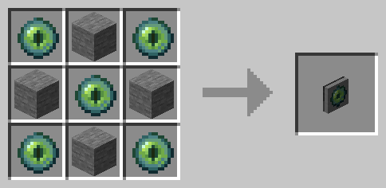

# CC Chunkloader upgrade

A very simple chunkloader upgrade mod for CC:Tweaked.

## Dependencies
This mod (obviously) requires [CC:Tweaked](https://www.curseforge.com/minecraft/mc-mods/cc-tweaked).  
Additionally _either_ [Kottle](https://www.curseforge.com/minecraft/mc-mods/kottle) or
[Kotlin for Forge](https://www.curseforge.com/minecraft/mc-mods/kotlin-for-forge) is required. 

## Crafting recipes

## API
When attached to a turtle the upgrade is a peripheral available through the
[Peripheral API](https://www.computercraft.info/wiki/Peripheral_(API)).

The following methods are exposed:
<table>
    <tr><th>Method name </th><th>Function</th></tr>
    <tr>
        <td>
               <code>setActive([true|false])</code>     
        </td>
        <td>
            Enable or disable chunk loading. This will be <code>false</code> by default
            and will reset to <code>false</code> on every reboot. If you want your turtle
            to keep loading chunks (and thus keep operating) after a reboot you need to
            make sure to call <code>setActive(true)</code> in your 
            <a href="https://www.computercraft.info/wiki/Startup">startup script</a>.
        </td>
    </tr>
    <tr>
        <td><code>isActive()</code></td>
        <td>
            Gets the current state (<code>true</code> or <code>false</code>) of the peripheral.
        </td>
    </tr>
</table>